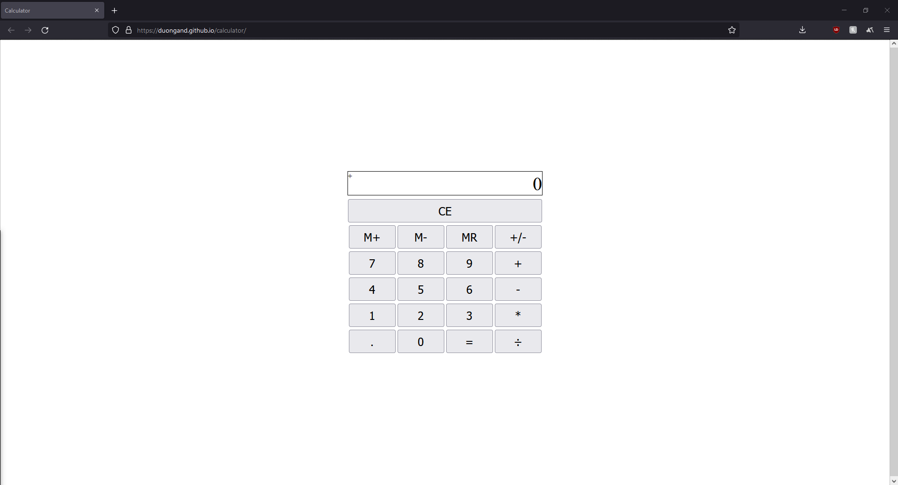

## calculator

The calculator application heavily employs Javascript to logically process arithmetic operations.  

[Live Demo](https://duongand.github.io/calculator/)

### Summary

Anyone can solve simple mathematical equations; however, things become hard to retain with more complex operations. A calculator is everyone's best friend in computing how much savings is given by a sale, the amount of tip for the meal, or even compute 1/7. The calculator features normal operations in addition to memoery operations. 

### Author

* **Anderson Duong** - Full-Stack Developer